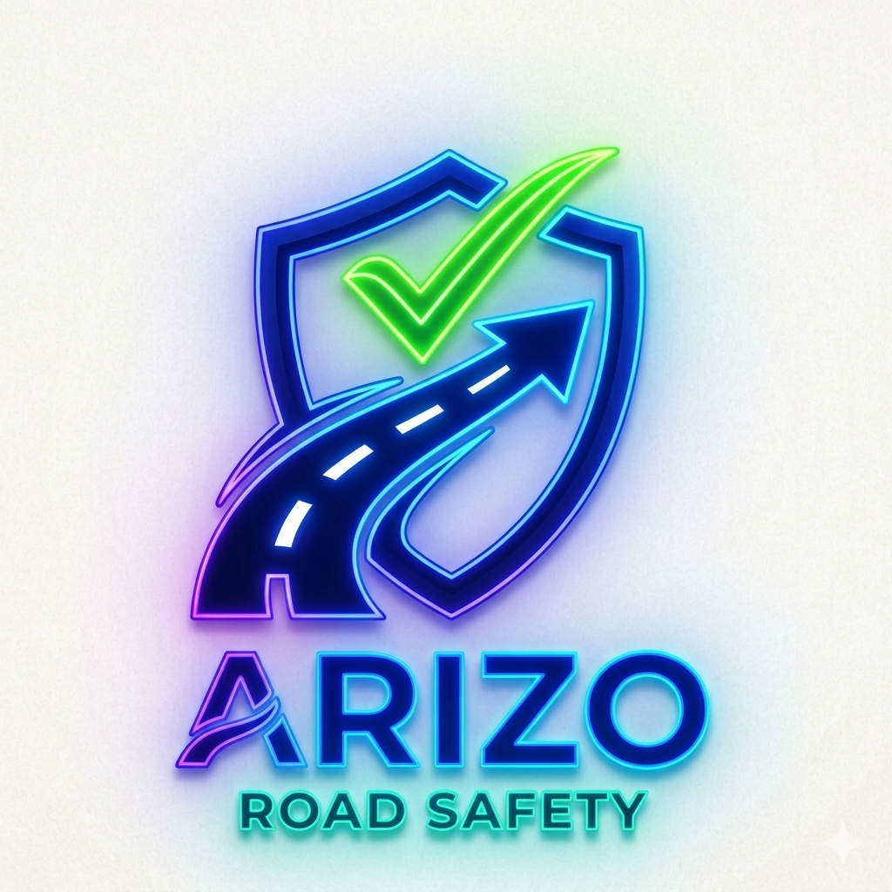

# 🚗 Arizo — India's First AI-Powered Offline Road Safety Platform

<div align="center">



[](https://flutter.dev)
[](https://developer.android.com)
[](https://tensorflow.org/lite)
[](LICENSE)

**Five Features. One Lifesaving Solution.**

[📱 Demo Video](#demo) • [✨ Features](#features) • [🛠️ Tech Stack](#tech-stack) • [🚀 Getting Started](#getting-started) • [👥 Team](#team)

</div>

---

## 📌 Problem Statement

India records **1.5 lakh road deaths annually** — one of the world's highest.

- 20% of accidents are caused by **drowsy driving** with no real-time detection solution
- Accident victims in **remote areas cannot alert emergency contacts** due to zero network
- Drivers have no instant access to **traffic laws in Indian languages**
- **Road hazards like potholes** go unreported in real time
- No single app covers all these critical gaps — existing apps are fragmented

---

## ✨ Features <a name="features"></a>

### 🧠 1. Cognitive Mode — AI Drowsiness Detection
Real-time eye monitoring using front camera + TensorFlow Lite. Detects micro-sleep within 1.5 seconds and triggers instant audio + vibration alert. Runs fully on-device — no internet needed.

### 📡 2. Bluetooth Mesh Chat — Offline Emergency Messaging
Peer-to-peer communication using Bluetooth LE mesh. Works in tunnels, Himalayan roads, and zero-network zones. Each Arizo user acts as a relay node, extending range up to 5 km.

### 🆘 3. Crash Triage SOS — Auto Emergency Alert
Accelerometer + gyroscope detects crash-level G-force. Triggers a 3-second countdown (cancel if false alarm), then auto-sends GPS location via SMS to emergency contacts — no internet required.

### 🤖 4. AI Traffic Chatbot — Multilingual Road Law Assistant
Ask traffic law questions in Hindi, Tamil, or English. Powered by Gemini AI with offline fallback cache. Explains Motor Vehicles Act rules in simple language for every driver.

### 🗺️ 5. Voice Pothole Detection — Crowdsourced Hazard Map
Say **"Pothole here"** to drop a live GPS warning pin visible to all nearby Arizo users. Pins stored on Firebase, displayed on a real-time map for the entire community.

---

## 🎥 Demo <a name="demo"></a>

> 📹 **[Watch Full Demo Video](https://youtu.be/YOUR_VIDEO_LINK_HERE)**

| Feature | Preview |
|---|---|
| Cognitive Mode | AI detects drowsiness in real-time |
| Crash SOS | Auto SMS with GPS in 3 seconds |
| Bluetooth Mesh | Chat with zero internet |
| Pothole Map | Voice-triggered hazard reporting |

---

## 🛠️ Tech Stack <a name="tech-stack"></a>

| Layer | Technology |
|---|---|
| **Mobile App** | Flutter 3.19+, Dart, Android SDK (API 26+), Kotlin |
| **AI / ML** | TensorFlow Lite, MediaPipe Face Mesh, OpenCV, Python, scikit-learn |
| **Communication** | Bluetooth LE Mesh (flutter_blue_plus), Auto SMS (telephony) |
| **Sensors** | Accelerometer, Gyroscope, GPS (geolocator), Speech-to-Text |
| **Backend** | Firebase Firestore, Firebase Auth, Google Maps SDK |
| **AI Chatbot** | Google Gemini API, Dialogflow |
| **Build Tool** | Flutter 3.19+, Gradle |

---

## 🚀 Getting Started <a name="getting-started"></a>

### Prerequisites
- Flutter SDK 3.19+
- Android Studio / VS Code
- Android device or emulator (API 26+)
- Google Gemini API key

### Installation

```bash
# 1. Clone the repository
git clone https://github.com/SHARUK-2008/Arizo--The-Road-Saftey-App.git

# 2. Navigate to project folder
cd Arizo--The-Road-Saftey-App

# 3. Install dependencies
flutter pub get

# 4. Add your API keys
# Create a file: lib/config/api_keys.dart
# Add: const String geminiApiKey = 'YOUR_API_KEY_HERE';

# 5. Run the app
flutter run
```

### Build APK
```bash
flutter build apk --release
```

---

## 📁 Project Structure

```
lib/
├── main.dart                    # App entry point
├── screens/
│   ├── home_screen.dart         # Main dashboard
│   ├── cognitive_load_screen.dart  # Drowsiness detection
│   ├── crash_triage_screen.dart    # Crash SOS
│   ├── chat_screen_bt.dart         # Bluetooth mesh chat
│   ├── chatbot_screen.dart         # AI traffic chatbot
│   └── pothole_screen.dart         # Hazard map
├── services/
│   ├── cognitive_load_service.dart
│   ├── bluetooth_chat_service.dart
│   └── chatbot_service.dart
├── theme/
│   └── app_theme.dart
└── widgets/
    ├── feature_card.dart
    └── status_header.dart
```

---

## 🏆 Hackathon Submissions

| Hackathon | Track | Status |
|---|---|---|
| IIT Madras Road Safety Hackathon 2026 | AI & Road Safety | Submitted |
| HackArena 2.0 Bangalore Zonals | Open Innovation | Submitted |
| Codorra Hackathon | Mobile + AI | Submitted |

---

## 🌍 Impact

- 🎯 Target: **19 Crore+** active Indian drivers
- 💀 Goal: Reduce road deaths by **40%** via early detection
- 💰 Infrastructure cost: **₹0** — offline-first, no hardware needed
- 📱 Works on any **mid-range Android phone**

---

## 👥 Team <a name="team"></a>

| Name | Role | College |
|---|---|---|
| **Sharuk Ifras I** | Team Lead & ML Engineer | Chennai Institute of Technology |
| **Karumuhilarsu K N** | Android Developer | Chennai Institute of Technology |
| **Ashwin Gowtham B** | UI/UX Designer | Chennai Institute of Technology |
| **Sri kanthan M** | Backend Developer | Chennai Institute of Technology |
|**Abishal Bose s**|backend developer|Android Developer | Chennai Institute of Technology |

📧 Contact: sharukifras011@gmail.com

---

## 📄 License

This project is licensed under the MIT License — see the [LICENSE](LICENSE) file for details.

---

<div align="center">

**⭐ Star this repo if Arizo could save a life!**

Made with ❤️ for India's 19 Crore Drivers

</div>
